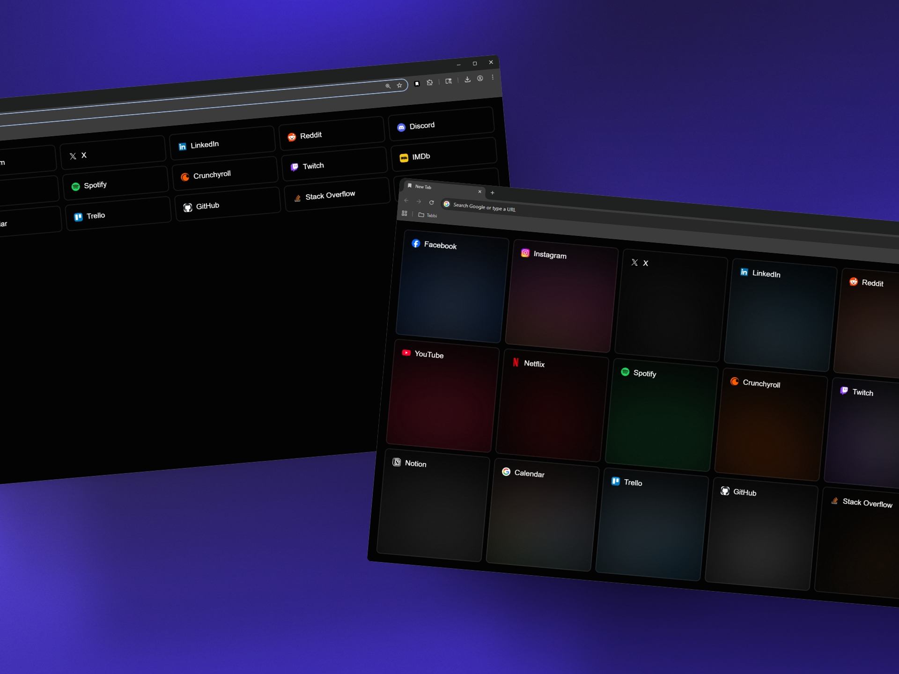

# tabbi

A minimal new tab replacement for Chromium-based browsers that displays your bookmarks in a clean, customizable layout.

_Reference image. Final result may vary._

## Features

- Replaces the default new tab page
- Define a folder to display bookmarks within
- Supports:
  - Loose bookmarks (shown in a column)
  - Subfolders (each shown as a column)
  - Mixed structures (intuitively displayed)
- Interactive links for quick access
- Customizable options

## Installation

Since the extension isn't published on the Chrome Web Store, you'll need to install it manually:

1. Download the extension files or clone the repository.
2. Go to `chrome://extensions/`
3. Enable **Developer mode** on top right corner, generally.
4. Click "Load unpacked" and select the extension folder — or drag the folder directly onto the page.

Works on Chrome, Brave, Edge, and other Chromium-based browsers.

## Usage

1. Create a bookmark folder called `tabbi` in your browser. You can change the folder's name from the extension options.
2. Add bookmarks or subfolders inside that folder — they'll be shown on the new tab page.
3. Open a new tab to see **tabbi** in action!

Press extension icon in your browser to customize options.

## Ethics

**tabbi** is built for personal use and aesthetic simplicity.
It does not track, store, or transmit any user data.

## License

This project is licensed under the **GNU General Public License v3.0**.
See the [LICENSE](LICENSE) file for more information.
