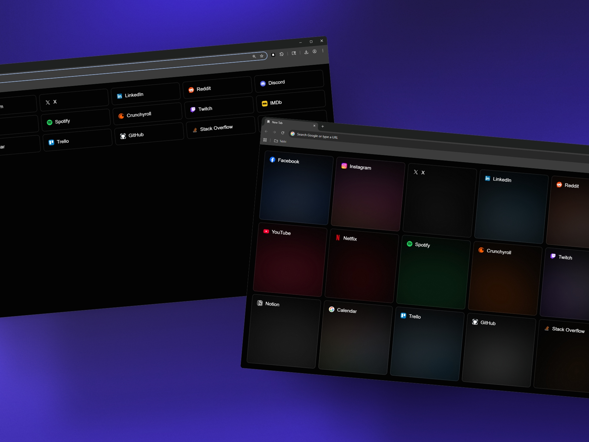

# Tabbi

A minimal new tab replacement for Chromium-based browsers that displays your bookmarks in a clean, customizable layout.

_Reference image, you can modify the layout to your liking_

## Features

- Replaces the default new tab page
- Displays bookmarks from a specific folder named `Tabbi`
- Supports:
  - Loose bookmarks (shown in a horizontal line)
  - Subfolders (each shown as a column)
  - Mixed structures (intuitively displayed)
- Interactive bookmark tiles for quick access
- Customizable options:
  - Dynamic backgrounds based on favicon colors
  - Compact mode (tile size adjusts to text)
  - Toggle UI animations
  - Choose a custom font for bookmark titles

## Installation

Since the extension isn't published on the Chrome Web Store, you'll need to install it manually:

1. Download the extension files or clone the repository.
2. Open `chrome://extensions/` (or your browser’s equivalent).
3. Enable Developer mode (top right toggle).
4. Click Load unpacked and select the extension folder — or drag the folder directly onto the page.

Works on Chrome, Brave, Edge, and other Chromium-based browsers.

## Usage

1. Create a bookmark folder called Tabbi in your browser.
2. Add bookmarks or subfolders inside Tabbi — they'll be shown on the new tab page.
3. Open a new tab to see Tabbi in action.
4. Click the ⚙️ icon to open settings and tweak appearance.

## Ethics

Tabbi is built for personal use and aesthetic simplicity. It does not track, store, or transmit any user data.

## License

This project is licensed under the **GNU General Public License v3.0**.
See the [LICENSE](LICENSE) file for more information.
